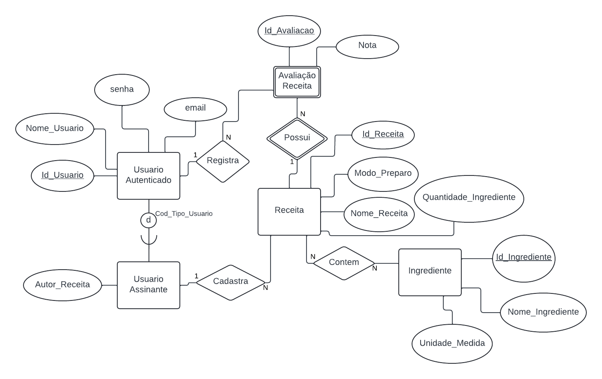

# Arquitetura da Solução

Pré-requisitos: <a href="3-Projeto de Interface.md"> Projeto de Interface</a>

Definição de como o software é estruturado em termos dos componentes que fazem parte da solução e do ambiente de hospedagem da aplicação.

## Diagrama de Classes

## Modelo ER (Projeto Conceitual)

## Projeto da Base de Dados

## Tecnologias Utilizadas

Para o desenvlvimento do site de receitas, a equipe utilizou as tecnologias abaixo especificadas.

### 1 - Ambiente de Desenvolvimento Integrado (IDE):

Utilizou-se como IDE o Visual Studio Community 2022 que é uma ferramente gratuita desenvolvida pela Microsofty e conta com suporte completo para desenvolvimento de aplicativos WEB, incluindo ASP.NET Core.

### 2 - Banco de Dados:

A equipe fez uso do SQL Server que é um sistema de gerenciamento de banco de dados relacional também desenvolvido pela Microsoft.

### 3 - Arquitetura e Estrutura do Projeto:

Foi utilizado o ASP.NET Core MVC, que é um padrão de arquitetura que divide o aplicativo em três partes principais: Model, View e Controller. Ele facilita a organização do código e a separação entre manipulação de dados (Model), interação do usuário (View) e camada de controle (Controller).

* Models: Contém as classes que representam os objetos do domínio (por exemplo, Receita, Ingredientes, Usuários etc.).
* Views: Contém as páginas Razor que exibem os dados para o usuário.
* Controllers: Contém os controladores que processam as solicitações HTTP e interagem com o banco de dados.
* Data: Contém o contexto do banco de dados e as migrações do Entity Framework.

### 4 - Linguagens de Programação:

Como requisito pré-definido para o projeto, utilizou-se a linguagem C#, que é uma linguagem de programação orientada a objetos. Ela é utilizada para escrever a lógica do aplicativo e manipular os dados. Já para a estruturação e formatação do conteúdo apresentado aos usuários, utilzou-se o HyperText Markup Language (HTML).

### 5 - Bibliotecas e Pacotes:

* Entity Framework Core: Um ORM (Object-Relational Mapping) que permite mapear objetos C# para tabelas SQL.
* Razor Pages: Uma sintaxe de visualização que permite criar páginas dinâmicas no ASP.NET Core.
* Microsoft.AspNetCore.Mvc.Rendering: fornece tipos usados para geração de HTML usando helpers de HTML.
* Identity Framework: Fornece autenticação e autorização para aplicativos ASP.NET Core.

### 6 - Hospedagem:

A aplicação desenvolvida foi hospedada na Azure, que é o serviço de computação em nuvem da Microsoft.

### 7 - Hospedagem do Projeto:

Utilizou-se o GitHub para a hospedagem da documentação e do código fonte do projeto.

Descreva aqui qual(is) tecnologias você vai usar para resolver o seu problema, ou seja, implementar a sua solução. Liste todas as tecnologias envolvidas, linguagens a serem utilizadas, serviços web, frameworks, bibliotecas, IDEs de desenvolvimento, e ferramentas.

Apresente também uma figura explicando como as tecnologias estão relacionadas ou como uma interação do usuário com o sistema vai ser conduzida, por onde ela passa até retornar uma resposta ao usuário.

## Hospedagem

Explique como a hospedagem e o lançamento da plataforma foi feita.

> **Links Úteis**:
>
> - [Website com GitHub Pages](https://pages.github.com/)
> - [Programação colaborativa com Repl.it](https://repl.it/)
> - [Getting Started with Heroku](https://devcenter.heroku.com/start)
> - [Publicando Seu Site No Heroku](http://pythonclub.com.br/publicando-seu-hello-world-no-heroku.html)
